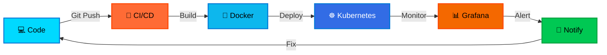
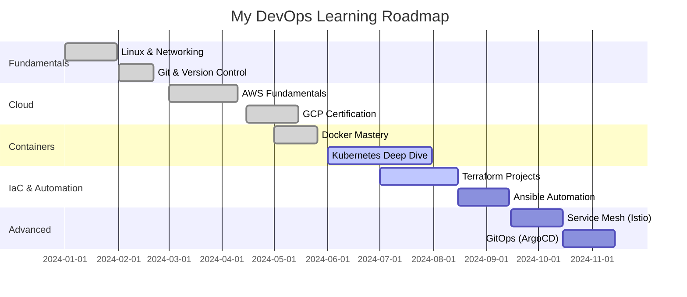

<div align="center">

```ascii
╔═══════════════════════════════════════════════════════════════════════════════╗
║                                                                               ║
║   ██████╗ ██████╗ ███████╗███████╗████████╗██╗  ██╗ █████╗ ███╗   ███╗      ║
║   ██╔══██╗██╔══██╗██╔════╝██╔════╝╚══██╔══╝██║  ██║██╔══██╗████╗ ████║      ║
║   ██████╔╝██████╔╝█████╗  █████╗     ██║   ███████║███████║██╔████╔██║      ║
║   ██╔═══╝ ██╔══██╗██╔══╝  ██╔══╝     ██║   ██╔══██║██╔══██║██║╚██╔╝██║      ║
║   ██║     ██║  ██║███████╗███████╗   ██║   ██║  ██║██║  ██║██║ ╚═╝ ██║      ║
║   ╚═╝     ╚═╝  ╚═╝╚══════╝╚══════╝   ╚═╝   ╚═╝  ╚═╝╚═╝  ╚═╝╚═╝     ╚═╝      ║
║                                                                               ║
║              🚀 DevOps Engineer | ☁️ Cloud Architect | 🔧 Automator          ║
╚═══════════════════════════════════════════════════════════════════════════════╝
```

<a href="https://git.io/typing-svg"></a>

<br/>

<!-- Animated Badges -->
<p align="center">
  
  
  
  
</p>

<!-- Social Links with Custom Styling -->
<p align="center">
  <a href="https://linkedin.com/in/preetham-pereira">
    
  </a>
  <a href="https://youtube.com/@cloud_with_preetham">
    
  </a>
  <a href="https://x.com/yourcloudguy_">
    
  </a>
  <a href="mailto:reachout.preetham@gmail.com">
    
  </a>
  <a href="https://discord.gg/AWFGj3vh">
    
  </a>
</p>


</div>

<br/>

<!-- DevOps Pipeline Visualization -->
<div align="center">



</div>

<br/>

<!-- About Section with Terminal Style -->
<div align="center">

## 🖥️ `whoami`

</div>

<table align="center">
<tr>
<td width="50%" valign="top">

```bash
┌──(preetham@devops)-[~]
└─$ cat about.yaml

name: "Preetham Pereira"
role: "DevOps Engineer"
location: "India 🇮🇳"
company: "TrainWithShubham"
experience: "Hands-on Training"

current_mission:
  - "#90DaysOfDevOps Challenge"
  - "Cloud-Native Architecture"
  - "Infrastructure Automation"
  - "CI/CD Pipeline Mastery"

philosophy: |
  "Automate Everything,
   Monitor Everything,
   Improve Everything"

status: "Learning & Building 🚀"
```

</td>
<td width="50%" valign="top">


### 🎯 Mission Statement

Transforming infrastructure into **code**, deployments into **automation**, and complexity into **simplicity**.

Building scalable, reliable, and secure cloud-native systems that empower teams to ship faster and sleep better.

**Core Values:**

- 🔄 Continuous Improvement
- 🤖 Automation First
- 📊 Data-Driven Decisions
- 🛡️ Security by Design

</td>
</tr>
</table>

<br/>

---

<!-- Skills Matrix -->
<div align="center">

## 🛠️ `Tech Arsenal`

</div>

<table align="center">
<tr>
<td width="50%" valign="top">

### ⚡ Core Competencies

```python
class DevOpsEngineer:
    def __init__(self):
        self.languages = ["Python", "Bash", "YAML", "HCL"]
        self.clouds = ["AWS", "Azure", "GCP"]
        self.containers = ["Docker", "Kubernetes", "Helm"]
        self.iac = ["Terraform", "Ansible"]
        self.cicd = ["GitHub Actions", "Jenkins", "GitLab CI"]
        self.monitoring = ["Prometheus", "Grafana", "ELK"]

    def daily_routine(self):
        while True:
            self.automate_infrastructure()
            self.optimize_pipelines()
            self.monitor_systems()
            self.learn_new_tech()
```

</td>
<td width="50%" valign="top">

### 📊 Skill Proficiency

```text
Cloud Platforms       ████████████████░░  85%
Kubernetes           ███████████████░░░  80%
Docker               ██████████████████  95%
Terraform            ████████████████░░  85%
CI/CD Pipelines      ███████████████░░░  80%
Python Automation    ████████████░░░░░░  70%
Monitoring & Logs    ███████████████░░░  75%
Linux Administration ████████████████░░  90%
```


</td>
</tr>
</table>

<br/>

<!-- Tech Stack with Categories -->
<details open>
<summary><b>☁️ Cloud & Infrastructure</b></summary>
<br/>
<p align="center">
  
</p>
</details>

<details open>
<summary><b>🐳 Containers & Orchestration</b></summary>
<br/>
<p align="center">
  
  
  
</p>
</details>

<details open>
<summary><b>🔄 CI/CD & Version Control</b></summary>
<br/>
<p align="center">
  
  
  
</p>
</details>

<details open>
<summary><b>📊 Monitoring & Observability</b></summary>
<br/>
<p align="center">
  
  
  
  
  
</p>
</details>

<details open>
<summary><b>💻 Languages & Scripting</b></summary>
<br/>
<p align="center">
  
  
  
</p>
</details>

<details>
<summary><b>🗄️ Databases & Frameworks</b></summary>
<br/>
<p align="center">
  
</p>
</details>

<br/>

---

<!-- Achievements Section -->
<div align="center">

## 🏆 `Achievements Unlocked`

</div>

<table align="center">
<tr>
<td align="center" width="25%">

<br/><b>Google Cloud</b><br/>Certified Professional
</td>
<td align="center" width="25%">

<br/><b>Kubernetes</b><br/>15+ Deployments
</td>
<td align="center" width="25%">

<br/><b>Docker</b><br/>100+ Containers Built
</td>
<td align="center" width="25%">

<br/><b>Terraform</b><br/>20+ Modules Created
</td>
</tr>
</table>

<br/>

<div align="center">

| 🎯 Achievement               | 📈 Impact                      | 🔧 Tools Used                     |
| :--------------------------- | :----------------------------- | :-------------------------------- |
| **Automated CI/CD Pipeline** | Reduced deployment time by 60% | GitHub Actions, Docker, K8s       |
| **Infrastructure as Code**   | Managed 15+ cloud resources    | Terraform, Ansible, AWS           |
| **Container Orchestration**  | Deployed 10+ microservices     | Kubernetes, Helm, Docker          |
| **Monitoring Setup**         | 99.9% uptime achieved          | Prometheus, Grafana, AlertManager |
| **Cost Optimization**        | Reduced cloud costs by 40%     | AWS Cost Explorer, Terraform      |
| **#90DaysOfDevOps**          | Completed 60+ days             | Multiple DevOps Tools             |

</div>

<br/>

---

<!-- Projects Showcase -->
<div align="center">

## 🚀 `Featured Projects`

</div>

<table align="center">
<tr>
<td width="50%" valign="top">

### 🔷 [Kubernetes Multi-Tier App](https://github.com/cloud-with-preetham)

```yaml
description: |
  Full-stack application deployed on K8s
  with automated CI/CD pipeline

tech_stack:
  - Kubernetes & Helm
  - Docker & Docker Compose
  - GitHub Actions
  - Prometheus & Grafana

features:
  - Auto-scaling
  - Rolling updates
  - Health monitoring
  - Log aggregation
```

[](https://github.com/cloud-with-preetham)


</td>
<td width="50%" valign="top">

### 🔶 [Terraform AWS Infrastructure](https://github.com/cloud-with-preetham)

```hcl
module "infrastructure" {
  source = "./modules"

  components = [
    "VPC with public/private subnets",
    "EKS cluster with node groups",
    "RDS database with backups",
    "S3 buckets with versioning",
    "CloudWatch monitoring"
  ]

  features = {
    auto_scaling    = true
    multi_az        = true
    backup_enabled  = true
  }
}
```

[](https://github.com/cloud-with-preetham)


</td>
</tr>

<tr>
<td width="50%" valign="top">

### 🔷 [CI/CD Pipeline Automation](https://github.com/cloud-with-preetham)

```bash
#!/bin/bash
# Automated deployment pipeline

stages=(
  "🔍 Code Quality Check"
  "🧪 Run Unit Tests"
  "🐳 Build Docker Image"
  "🔐 Security Scan"
  "☸️  Deploy to K8s"
  "✅ Health Check"
)

for stage in "${stages[@]}"; do
  echo "Executing: $stage"
  # Automation magic happens here
done
```

[](https://github.com/cloud-with-preetham)


</td>
<td width="50%" valign="top">

### 🔶 [Monitoring Stack Setup](https://github.com/cloud-with-preetham)

```python
# Monitoring as Code
monitoring_stack = {
    'prometheus': {
        'scrape_interval': '15s',
        'targets': ['app:8080', 'db:5432']
    },
    'grafana': {
        'dashboards': ['system', 'app', 'db'],
        'alerts': ['cpu', 'memory', 'disk']
    },
    'alertmanager': {
        'routes': ['slack', 'email', 'pagerduty']
    }
}
```

[](https://github.com/cloud-with-preetham)


</td>
</tr>
</table>

<div align="center">

[](https://github.com/cloud-with-preetham?tab=repositories)

</div>

<br/>

---

<!-- GitHub Stats -->
<div align="center">

## 📊 `GitHub Analytics`

</div>

<div align="center">
  
  
</div>

<div align="center">
  
  
</div>

<br/>

<div align="center">


</div>

<br/>

---

<!-- Blog Section -->
<div align="center">

## 📝 `Latest Blog Posts`

</div>

<table align="center">
<tr>
<td width="50%">

### 📰 Recent Articles

- 🐳 [**Docker Multi-Stage Builds: Optimize Your Images**](https://dev.to)
  _Learn how to reduce Docker image sizes by 70%_
  `Docker` `Optimization` `Best Practices`

- ☸️ [**Kubernetes Deployment Strategies Explained**](https://dev.to)
  _Rolling, Blue-Green, and Canary deployments_
  `Kubernetes` `DevOps` `Deployment`

- 🔧 [**Terraform Best Practices for Production**](https://dev.to)
  _Infrastructure as Code done right_
  `Terraform` `IaC` `AWS`

</td>
<td width="50%">

### 🎥 YouTube Content

- 🚀 [**Complete CI/CD Pipeline Tutorial**](https://youtube.com/@cloud_with_preetham)
  _Build a production-ready pipeline from scratch_

- ☁️ [**AWS EKS Cluster Setup Guide**](https://youtube.com/@cloud_with_preetham)
  _Deploy Kubernetes on AWS the right way_

- 📊 [**Monitoring with Prometheus & Grafana**](https://youtube.com/@cloud_with_preetham)
  _Complete observability stack setup_

<br/>

[](https://youtube.com/@cloud_with_preetham)

</td>
</tr>
</table>

<br/>

---

<!-- Learning Journey -->
<div align="center">

## 🎓 `Learning Journey`

</div>



<br/>

<div align="center">

### 📚 Currently Learning


</div>

<br/>

---

<!-- Activity Section -->
<div align="center">

## 📈 `Contribution Activity`

</div>

<div align="center">


</div>

<br/>

<div align="center">


</div>

<br/>

---

<!-- Quote Section -->
<div align="center">

## 💭 `Dev Wisdom`


</div>

<br/>

---

<!-- Connect Section -->
<div align="center">

## 🤝 `Let's Connect & Collaborate`

</div>

<table align="center">
<tr>
<td width="50%" align="center">

### 💬 Open For

```json
{
  "collaboration": [
    "Open Source Projects",
    "DevOps Consulting",
    "Technical Writing",
    "Community Building"
  ],
  "discussions": [
    "Cloud Architecture",
    "Kubernetes Patterns",
    "CI/CD Best Practices",
    "Infrastructure Automation"
  ],
  "mentorship": [
    "DevOps Beginners",
    "Career Guidance",
    "Tool Selection",
    "Learning Paths"
  ]
}
```

</td>
<td width="50%" align="center">

### 📫 Reach Me

<br/>

[](https://linkedin.com/in/preetham-pereira)

[](mailto:reachout.preetham@gmail.com)

[](https://discord.gg/AWFGj3vh)

[](https://x.com/yourcloudguy_)

<br/>

**Response Time:** Usually within 24 hours ⚡

</td>
</tr>
</table>

<br/>

---

<!-- Footer -->
<div align="center">

```ascii
╔════════════════════════════════════════════════════════════════════════╗
║                                                                        ║
║  "The best way to predict the future is to automate it."               ║
║                                                                        ║
║  💡 Fun Fact: I automate my automation scripts!                        ║
║                                                                        ║
╚════════════════════════════════════════════════════════════════════════╝
```

<br/>

### ⚡ Quick Stats


<br/>


**Thanks for visiting! Let's build something amazing together! 🚀**

<sub>Last updated: Auto-generated by GitHub Actions ⚙️</sub>

</div>
